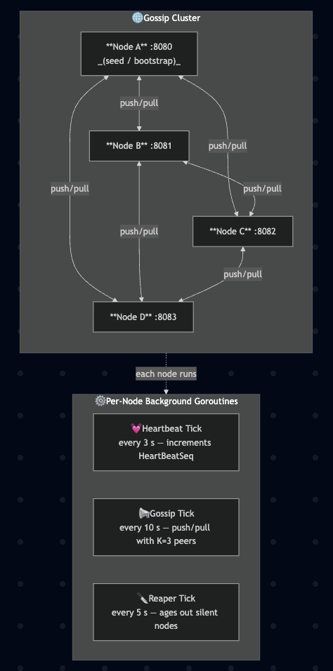
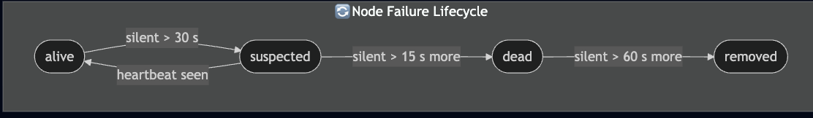
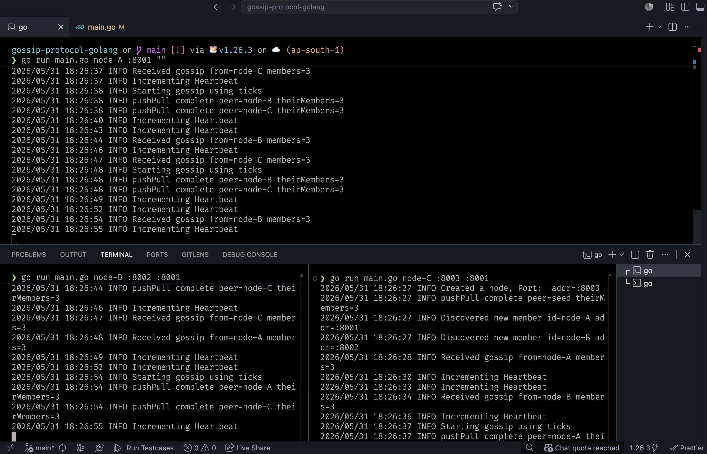
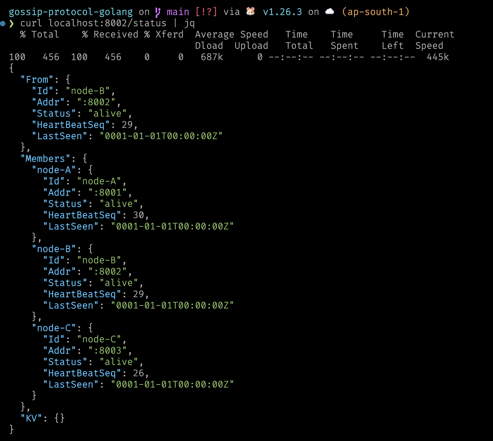
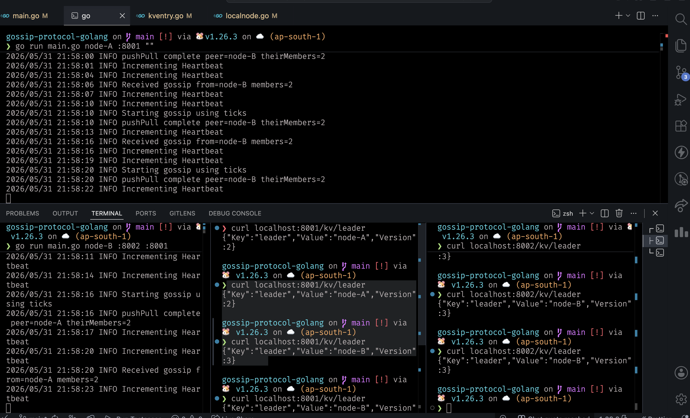
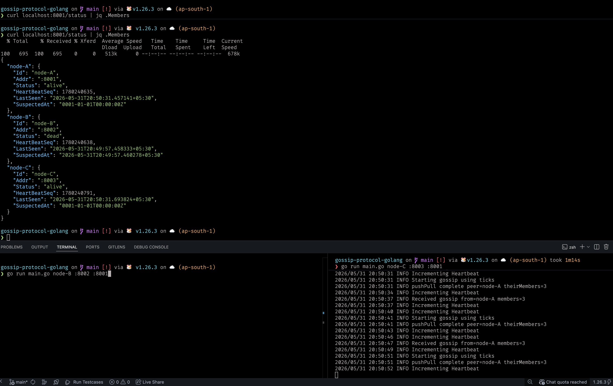
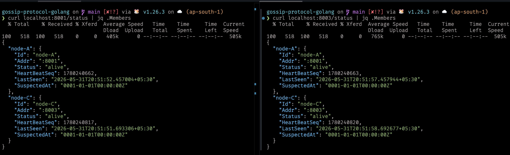

<div align="center">

# 🦠 Gossip Protocol in Go

**A distributed systems implementation of the Gossip (Epidemic) Protocol, featuring peer discovery, failure detection, and replicated key-value storage.**

[](https://go.dev/)
[](LICENSE)
[](https://github.com/Prayag2003/gossip-protocol-golang/pulls)

</div>

---

## 📑 Table of Contents

1. [Overview](#-overview)
2. [Architecture](#-architecture)
3. [Features](#-features)
4. [How It Works](#-how-it-works)
   - [Gossip / Push-Pull Exchange](#gossip--push-pull-exchange)
   - [Heartbeat Mechanism](#heartbeat-mechanism)
   - [Failure Detection & Reaping](#failure-detection--reaping)
   - [Distributed KV Store](#distributed-kv-store)
5. [Getting Started](#-getting-started)
   - [Prerequisites](#prerequisites)
   - [Build](#build)
   - [Running Nodes Manually](#running-nodes-manually)
   - [Using the Makefile](#using-the-makefile)
6. [API Reference](#-api-reference)
7. [Demo & Screenshots](#-demo--screenshots)
8. [Configuration Reference](#-configuration-reference)

---

## 🌐 Overview

This project is a from-scratch Go implementation of the **Gossip Protocol** (also known as the Epidemic Protocol), the same family of algorithms used in real-world distributed systems such as **Cassandra**, **Consul**, and **CockroachDB** for cluster membership and state propagation.

The implementation demonstrates:
- Decentralised, leaderless peer discovery
- Epidemic information dissemination (no single point of failure)
- Node health tracking with a three-phase lifecycle (`alive → suspected → dead`)
- Eventually-consistent, versioned key-value storage that propagates across the entire cluster via gossip

---

## 🏛️ Architecture



---

## ✨ Features

| Feature | Details |
|---|---|
| **Peer Discovery** | New nodes bootstrap via a seed address and discover the rest of the cluster through gossip |
| **Push-Pull Gossip** | Every gossip round a node sends its full state and receives the peer's full state, merging both |
| **Heartbeat Sequencing** | Each node monotonically increments its `HeartBeatSeq`; stale updates are ignored |
| **Three-Phase Failure Detection** | `alive` → `suspected` (after 30 s silence) → `dead` (after 15 s suspected) → removed (after 60 s dead) |
| **Node Resurrection** | A node that reappears with a higher heartbeat sequence is automatically promoted back to `alive` |
| **Fan-out Gossip (K=3)** | Each cycle gossips to at most 3 randomly chosen alive peers, bounding network traffic |
| **Distributed KV Store** | Write to any node, read from any node — keys propagate cluster-wide via the next gossip round |
| **Versioned KV Entries** | Logical clock versioning ensures last-writer-wins semantics with no conflicts |
| **Concurrent-Safe** | All shared state is protected with `sync.RWMutex` |
| **Structured Logging** | Uses Go's `log/slog` for JSON-friendly structured output |

---

## ⚙️ How It Works

### Gossip / Push-Pull Exchange

Every **10 seconds** each node:
1. Collects all **alive peers** from its membership table.
2. Randomly shuffles the list and picks **up to K=3** peers (fan-out).
3. For each chosen peer, sends a `POST /gossip` request containing its full `GossipMessage` (members + KV store).
4. The peer **merges** the incoming state into its own and replies with its own `GossipMessage`.
5. The initiator merges the reply — both nodes converge toward the same view.

```
Node A                              Node B
  │                                   │
  │── POST /gossip {A's state} ──────►│
  │                                   │ merge(A's state)
  │◄── 200 OK {B's state} ───────────│
  │ merge(B's state)                  │
```

### Heartbeat Mechanism

Every **3 seconds** a node increments its own `HeartBeatSeq` and updates its `LastSeen` timestamp. When this heartbeat is gossiped to peers, they only accept the update if the incoming `HeartBeatSeq` is **strictly greater** than what they already have — preventing stale data from overwriting fresh data.

### Failure Detection & Reaping

A **reaper goroutine** runs every **5 seconds** and ages out nodes through three states:

```
alive ──(no contact for 30s)──► suspected ──(15s more)──► dead ──(60s more)──► removed
```

| State | Trigger | Action |
|---|---|---|
| `suspected` | >30 s since `LastSeen` | Marked suspect; `SuspectedAt` recorded |
| `dead` | >15 s since `SuspectedAt` | Marked dead |
| removed | >60 s since `SuspectedAt` | Deleted from membership table |

A node that sends a heartbeat with a higher sequence after being suspected is automatically **resurrected** to `alive`.

### Distributed KV Store

- **Write**: `POST /kv` with `{"Key": "...", "Value": "..."}` to any node.
- **Read**: `GET /kv/<key>` from any node.
- Keys carry a **monotonically increasing version** (logical clock). During merges, only the higher-versioned entry wins — last writer wins, no conflicts.
- Since gossip runs every 10 s and fans out to 3 peers, any write propagates to the entire cluster within a few gossip rounds.

---

## 🚀 Getting Started

### Prerequisites

| Tool | Version |
|---|---|
| [Go](https://go.dev/dl/) | 1.22 or later |
| `curl` | any recent version |
| `jq` _(optional)_ | for pretty-printing JSON responses |
| `make` | for Makefile targets |

### Build

```bash
git clone https://github.com/Prayag2003/gossip-protocol-golang.git
cd gossip-protocol-golang
make build          # compiles → ./bin/gossip-node
```

### Running Nodes Manually

Each node is started with three positional arguments:

```
./bin/gossip-node <ID> <ADDR> <SEED_ADDR>
```

| Argument | Description | Example |
|---|---|---|
| `ID` | Human-readable node identifier | `A` |
| `ADDR` | `host:port` this node listens on | `:8080` |
| `SEED_ADDR` | Address of an existing node to contact on startup (`""` for the first node) | `:8080` |

**Terminal 1 — bootstrap / seed node:**
```bash
./bin/gossip-node Node-A :8080 ""
```

**Terminal 2 — join via Node A:**
```bash
./bin/gossip-node Node-B :8081 :8080
```

**Terminal 3:**
```bash
./bin/gossip-node Node-C :8082 :8080
```

**Terminal 4:**
```bash
./bin/gossip-node Node-D :8083 :8080
```

### Using the Makefile

```bash
make help           # list all available targets
make build          # build the binary
make run-a     # start Node A (seed)
make run-b     # start Node B
make run-c     # start Node C
make run-d     # start Node D
make cluster        # launch all 4 nodes in separate Terminal tabs (macOS)

# Inspect cluster state
make node-a  # curl /status on Node A + pretty-print
make node-b
make node-c
make node-d

# KV store operations
make kv-write PORT=:8080 KEY=leader VALUE=nodeA
make kv-read  PORT=:8082 KEY=leader    # read same key from a different node
```

---

## 📡 API Reference

All endpoints speak JSON.

### `POST /gossip`

Internal peer-to-peer gossip exchange. Not intended for direct use.

**Request body:**
```json
{
  "From": { "Id": "A", "Addr": ":8080", "Status": "alive", "HeartBeatSeq": 42 },
  "Members": { "A": { ... }, "B": { ... } },
  "KV": { "leader": { "Value": "nodeA", "Version": 1 } }
}
```

**Response:** The receiving node's current `GossipMessage` (same schema).

---

### `GET /status`

Returns the node's full membership table and KV store snapshot.

```bash
curl http://localhost:8080/status | jq .
```

**Response:**
```json
{
  "From": { "Id": "A", "Addr": ":8080", "Status": "alive", "HeartBeatSeq": 17 },
  "Members": {
    "A": { "Id": "A", "Addr": ":8080", "Status": "alive", "HeartBeatSeq": 17, ... },
    "B": { "Id": "B", "Addr": ":8081", "Status": "alive", "HeartBeatSeq": 12, ... }
  },
  "KV": {
    "leader": { "Value": "nodeA", "Version": 1 }
  }
}
```

---

### `POST /kv`

Write a key-value pair to this node. The entry will propagate cluster-wide via gossip.

```bash
curl -X POST http://localhost:8080/kv \
     -H "Content-Type: application/json" \
     -d '{"Key":"leader","Value":"nodeA"}'
```

**Response:** `200 OK` (no body)

---

### `GET /kv/<key>`

Read a key from this node's local store.

```bash
curl http://localhost:8082/kv/leader | jq .
```

**Response:**
```json
{
  "Key": "leader",
  "Value": "nodeA",
  "Version": 1
}
```

---

## 📸 Demo & Screenshots

### All Nodes Alive

> Cluster of 3 nodes with all members in `alive` state.



---

### Node Status View

> `/status` endpoint output showing the full membership table and current heartbeat sequences.



---

### KV Propagation

> A key written to Node A appears on Node C after the next gossip round — demonstrating eventual consistency.



---

### Dead Node B

> Node B is shut down; after 30 s it transitions to `suspected`, then to `dead` after a further 15 s.



---

### Node B Removed from Membership

> After 60 s in `dead` state, Node B is permanently removed from all peers' membership tables.



---

## 🔧 Configuration Reference

All timing parameters live in [`main.go`](main.go) and [`internal/localnode.go`](internal/localnode.go):

| Parameter | Default | Description |
|---|---|---|
| Heartbeat interval | 3 s | How often a node increments its sequence |
| Gossip interval | 10 s | How often a node initiates push-pull rounds |
| Reaper interval | 5 s | How often the reaper runs |
| Fan-out `K` | 3 | Max peers contacted per gossip round |
| Suspect threshold | 30 s | Time since `LastSeen` before marking `suspected` |
| Dead threshold | 15 s | Time since `SuspectedAt` before marking `dead` |
| Remove threshold | 60 s | Time since `SuspectedAt` before removing from table |
| HTTP client timeout | 10 s | Per-request timeout for gossip POST calls |
| Max request body | 1 MB | Guard against oversized gossip payloads |

